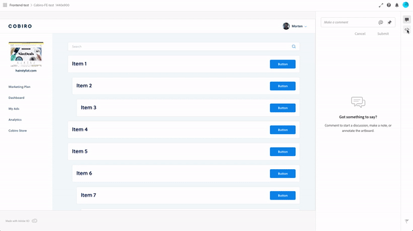

# Cobiro frontend test

## Pre requisits
- Node v12.x

## Start the project

```
// Fork the repo

// Clone the project
git@github.com:YOUR_GITHUB_USER/frontend-test.git

// Change directory into project directory
cd frontend-test

// Install the project
npm i

// Run the application
npm start

// Run the mock server
npm run start:server
```

## Design spec

Here we provide a url with the design spec on what you will be making:
https://xd.adobe.com/view/28004468-172c-41f8-6b22-b719d5d9b0d4-5e31

Here is a small guide on how to see the developer specs for the design file 


## Task

Here is a list of things we want you to do; 

- Use html and scss to style the layout of the page and a non-dynamic sidebar
- Get the list of items from the mock server at `http://localhost:3000/items` show these items on the page
- Make the items searchable by title
- Indent the item based on the parent_id's in the list so it creates a tree stucture see design file where we indent based on where they are in the tree stucture

## Bonus points

- Write tests
- Make a sub page for the items so when you click the button you route to the sub page 
<br />(Note you can get single item by calling `http://localhost:3000/items/:id`)
- Make the layout responsive
